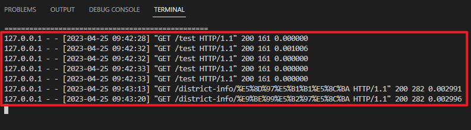

# newCodingTemplate
一个基于 Vue 2.0 + Flask的Web App模板

***  
## 目录
- [newCodingTemplate](#newcodingtemplate)
  - [目录](#目录)
  - [运行指南](#运行指南)
    - [环境配置](#环境配置)
      - [前端](#前端)
      - [后端](#后端)
    - [运行框架](#运行框架)
      - [运行前端](#运行前端)
      - [运行后端](#运行后端)
    - [可能遇到的问题](#可能遇到的问题)
  - [Web框架总览](#web框架总览)
  - [目录结构](#目录结构)
    - [前端](#前端-1)
      - [1. frontend目录](#1-frontend目录)
      - [2. package.json](#2-packagejson)
      - [3. 前端代码目录 (./frontend/src)](#3-前端代码目录-frontendsrc)
    - [后端](#后端-1)
  - [案例](#案例)
    - [前后端交互](#前后端交互)
    - [前端交互 - component内部](#前端交互---component内部)
    - [前端交互 - 不同component联动](#前端交互---不同component联动)

***  
  
## 运行指南
### 环境配置
#### 前端  
使用Node.js作为JavaScript的运行环境, NPM为Node.js的包管理器  
  
Node.js: https://nodejs.org/zh-cn/download/  

初始化：
以下操作在命令行中进行，只用执行一次:  
1. 进入目录 .../newCodingTemplate/frontend/
2. 输入 npm install
3. npm自动下载所需的包

#### 后端  
使用Anaconda作为python的运行环境  
(安装过程中建议添加至系统环境变量)  
  
Anaconda：https://www.anaconda.com/products/distribution  
Anaconda默认的下载源在国外，访问较慢，可以换成清华源：https://mirrors.tuna.tsinghua.edu.cn/help/anaconda/  
安装flask：在命令行中执行 conda install flask 或 pip install flask  

### 运行框架
#### 运行前端  
以下操作在命令行中进行:  
1. 进入目录 .../newCodingTemplate/frontend/
2. 输入 npm run serve
3. 运行成功结果  

 </img> 

#### 运行后端
以下操作在命令行中进行:  
1. 进入目录 .../newCodingTemplate/backend/
2. 输入 python run-data-backend.py
3. 运行成功结果  

 </img> 

### 可能遇到的问题
1. 前端报错

## Web框架总览
该框架采用前后端分离的开发模式，前端框架采用Vue 2.0，语言是JavaScript，后端框架采用flask，语言是python。前端实现网页及交互，后端用于处理数据。当前端需要获取数据时，会向后端发送数据请求，后端会将处理好的数据反馈给前端。   
  
|  | 端口号 | URL |
| :----: | :----: | :----: |
| 前端 | 8080 | https://127.0.0.1:8080/ |
| 后端 | 5010 | https://127.0.0.1:5010/ |
  
 </img> 

## 目录结构
### 前端
#### 1. frontend目录  
.../newCodingTemplate/frontend/的文件夹内容如下： 

| 文件/文件夹名称 | 主要内容 |
| :----: | :----: |
| ./node_modules | npm下载的包 |
| ./src | 前端代码 |
| package.json | 包管理描述文件 |

#### 2. package.json  
package.json文件描述了npm的各项设置，主要是需要安装什么包，安装什么版本，以及报错规则，文件打开是一个字典  
"dependencies"指需要下载的包，需要注明包的名称以及版本要求，具体可参考:  

| 写法 | 含义 |
| :----: | :----: |
| "4.0.3" | 安装4.0.3版本 |
| "~4.1.3" | 安装4.1.x版本，不低于4.1.3 |
| "^4.2.3" | 安装4.x.x版本，不低于4.2.3 |
| "latest" | 安装最新版本 |  
  
"rules"指报错规则，这里的报错还包括代码书写规范，例如"禁止使用八进制数字"、"禁止使用++,--"等  
vue采用eslint规则，具体可参考: https://www.jianshu.com/p/efeeaacc6ef0  
  
不规范的写法会降低代码的可读性，有必要做出一定限制，但有些规则可以考虑关闭，例如"no-unused-vars"(变量声明后必须使用)：  
```javascript
    "rules": {
      "no-console": 0,
      "no-unused-vars": 0
    },  
```  
  
更新package.json后，需要重新npm install  

#### 3. 前端代码目录 (./frontend/src)
**强烈建议学习Vue之后阅读!**  
Vue 2.0教程: https://learning.dcloud.io/#/?vid=0  
Vue 3.0教程: https://www.vuemastery.com/courses/intro-to-vue-3/intro-to-vue3 (比较推荐，看前几个免费的就够了)  
Vue 2.0与3.0有一定差别，但基本写法差异不大，学哪个都行    
***

./src目录下有很多文件与文件夹，比较重要的如下表所示:  

| 文件/文件夹名称 | 主要内容 |
| :----: | :----: |
| ./components | vue组件 |
| ./service | 数据请求、组件信息传递的代码 |
| App.vue | 前端主组件 |
| main.js | 创建APP |

下面简要说明:  
**(1) 各个组件 (./components)**   
网站的各个View其实就是一个个component  
 </img>  

每个component都有一个独立的文件夹，HTML、CSS、JS代码都可以独立修改，最后在主组件组合即可。  
以InteractionView为例，在./components/InteractionView可以看到:     
  
| 文件名称 | 主要内容 |
| :----: | :----: |
| InteractionView.html | HTML模板 |
| InteractionView.js | component核心代码 |
| drawD3.js | 绘图函数 |
| InteractionView.vue | CSS样式 |   
    
    
1. component核心代码 (InteractionView.js)
  
首先发现这是一个字典:  
```javascript
import DrawFunc from './drawD3.js'    
//括号内容省略  
export default {  
    name: 'InteractionView',  
    components: {},  
    props:{},  
    data() {  
     return {},  
    },  
    watch:{},  
    mounted:{},  
    methods:{}  
}  
```
  
每个key都有对应的功能：  

| key | 含义 |
| :----: | :----: |
| name | 当前component名称 |
| components | 包含的components |
| props | 主组件传递的值 |
| data | 当前component内置变量 |  
| watch | 监测某变量是否变化，变化后执行什么函数 | 
| mounted | 页面加载完成后执行的函数，可用于初始化 |   
| methods | 当前component内置函数 |   
    
对于component而言，任何地方的`this`均指代当前component整体。可以使用`this.XXX`的形式调用/修改内置的变量或函数  
```javascript  
    methods: { 
        addCircle() {
            this.click_cnt = this.click_cnt + 1;   //令内置变量click_cnt的值+1
            this.drawFunc.drawCircles(this.click_cnt);   //调用内置变量drawFunc的drawCircles函数
        },
```  
***  
2. 绘图函数 (drawD3.js) 
函数名称随意，我们当前component需要用到的绘图函数封装成一个对象：  
  
```javascript
//定义一个名叫DrawFunc的对象
var DrawFunc = function () {	
    //JavaScript万物皆是对象，我们就选用函数来构造这个对象
    this.name = "DrawFunc函数";  //可以自行添加一些属性，this指代DrawFunc
    this.array = [1,2,3];
    this.width = 500;
    this.height = 300;
    this.margin = {top:10, bottom:10, left:10, right:10};
}
  
//向DrawFunc对象中添加drawCircles函数
DrawFunc.prototype.drawCircles = function (times_cnt) {  
    //绘图具体过程略
}

```  

**(2) 主组件 App.vue**  
主组件将各个component进行组合，文件像HTML和JavaScript的混合，可分为三部分: `<template>`、`<script>`和`<style>`   
（在VSCode中可安装插件Vue Language Feature辅助阅读）  
  
| 部分名称 | 主要内容 |
| :----: | :----: |
| `<template>` | HTML模板 |
| `<script>` | 主组件核心代码 |
| `<style>` | CSS样式 | 
  
    
1. 主组件核心代码 `<script>`  
这部分写法跟component差不多，区别在于要引用需要的component:  

```javascript  
import VolumnView from './components/VolumnView/VolumnView.vue'  //对应component的位置  
import CandleView from './components/CandleView/CandleView.vue'    
    
export default {
      name: 'app',  
      components: {  
        VolumnView,  //这里也要注明需要的component  
        CandleView,  
      },  
      // 其余部分略   
    }  
```  
      
2. HTML模板 `<template>`  
在此处写网页的HTML，此时每个component可用特殊标签代替，例如`<VolumnView></VolumnView>`,`<CandleView></CandleView>`
  

**(3) 数据请求与信息传递 (./service)**  
1. 数据请求 (dataService.js)  
  
dataService较为简单，即向python后端发送请求，获得后端发送回来的数据。  
dataService.js前面不用动，只需在后面补充函数即可:  
```javascript  
//请求数据的URL固定  
function getData(callback) {   //callback为回调函数，不需要写，只需要在调用dataService时补充即可
    const url = `${dataServerUrl}/getData`   //此处需修改为请求数据的URL
    const params = {}
    request(url, params, GET_REQUEST, callback)
}

//请求数据的URL和某些变量有关，例如:
//请求深圳11月17号的数据 - http://127.0.0.1:5010/shenzhen/1117/
//请求广州12月18号的数据 - http://127.0.0.1:5010/guangzhou/1218/
function getDataWithVar(city,date,callback) {   //callback为回调函数, 其余为变量
    const url = `${dataServerUrl}/${city}/${date}/`   //此处需修改为请求数据的URL
    const params = {}
    request(url, params, GET_REQUEST, callback)
}

//将函数打包进dataService
export default {
    ...,
    getData,   //注意在文件末尾export default处添加你写的函数
    getDataWithVar,
    ...,
}  
    
``` 

***
调用dataService举例:  
```javascript  
import dataService from '../../service/dataService.js'  //注意import

//请求数据的URL固定
dataService.getData((callback) => {
    const data = callback.data;   //回调函数的输入包含其他信息，只有data属性是获得的数据
    
    //补充其他想要执行的代码，获得数据后开始执行
    
});

//请求数据的URL和某些变量有关
var city = "shenzhen";
var date = 1117;

dataService.getDataWithVar(city,date,(callback) => {  //除callback外，添加相关变量
    const data = callback.data;   //回调函数的输入包含其他信息，只有data属性是获得的数据
    
    //补充其他想要执行的代码，获得数据后开始执行
    
});

```  
***  

2. 信号传递 (pipeService.js)  
  
Vue支持组件的之间的信号传递（例如`this.$emit`发送信号，`@`收到信号)，但写法比较麻烦，而且仅限于主组件与components之间通信，各个component之间无法直接传递信号。因此我们引入pipeService.js，简化组件传递的过程。  
  
pipeService.js的代码结构如下:  
  
```javascript
const dataServerUrl = process.env.DATA_SERVER_URL || 'http://127.0.0.1:5010' //后端地址:http://127.0.0.1:5010  
  
var pipeService = new Vue({
    data: {
        ADDCIRCLE: 'add_circle',  //信号名称: add_circle
    },
    methods: {
        emitAddCircle: function (msg) {  //发送add_circle信号
            this.$emit(this.ADDCIRCLE, msg)
        },
        onAddCircle: function (callback) {  //接收add_circle信号
            this.$on(this.ADDCIRCLE, function (msg) {
                callback(msg)
            })
        },
    }
})
  
```  
同样，pipeService里面的函数是**一个通用的框架**，每个函数不需要改很多，只需要修改`this.$emit()`和`this.$on()`里面的信号名称即可。  
  
在调用pipeService时，则需要补充一些代码，下面举一个例子：  
  
发送add_circle信号时，调用`pipeService.emitAddCircle`
```javascript
import pipeService from '../../service/pipeService.js'  //注意import
pipeService.emitAddCircle(msg);   //msg为需要传递的变量，可以不填

```
  
接收add_circle信号时，**在component的mounted处**添加如下代码:  
```javascript  
import pipeService from '../../service/pipeService.js'  //注意import

mounted:{
    pipeService.onAddCircle((msg) => {
    //msg为pipeService.emitAddCircle传递的变量
    
    //补充其他想要执行的代码，收到信号后开始执行
    
    });
},

```  


### 后端  
后端较为简单，在./backend/app/文件夹内可以看到三个文件夹:  
  
| 文件夹 | 含义 |
| :----: | :----: |
| ./data | 数据文件放在这 |
| ./dataService | 读取、处理数据的函数 |
| ./routes | 设置请求数据URL |
  
**(1) 设置请求数据URL (./routes/index.js)**   
进入./routes文件夹，打开index.py  
index.py记录了所有请求数据的URL，只需要在后面添加相应的函数即可:  
   
```python
# 请求数据的URL固定
@app.route('/linechart')   # 请求该数据的URL
def _get_line_chart():
    result = dataService.get_line_chart_data()  # 读取、处理数据的函数
    return json.dumps(result)  # 返回json格式的数据给前端
    
# 请求数据的URL和某些变量有关
@app.route('/videoInfo/<video_id>')   #<video_id>指将URL的这一部分赋值给video_id变量
# 例如：前端向http://localhost:5010/videoInfo/666/发送请求，那么video_id="666"
def _get_video_info(video_id):
    result = dataService.get_video_info(video_id)  # 读取、处理数据的函数
    return json.dumps(result)  # 返回json格式的数据给前端
```  

**(2) 读取、处理数据 (./dataService/dataService.py)**   
进入./dataService文件夹，打开dataService.py  
dataService.py记录了所有读取、处理数据的函数，可直接在后面添加:  

```python
import GlobalVariable as GV  #模板中将数据文件地址保存在GlobalVariable.py中，为了方便不做这一步也行

# 直接读取某数据
def get_line_chart_data(self):
    with open('{}/lineChartData.json'.format(GV.DATA_FOLDER), 'r') as rf:  #读取本地数据
        result = json.load(rf)
    return result

# 数据的位置和某些变量有关
def get_video_info(self, video_id):
    video_path = os.path.join(GV.VIDEO_FOLDER, '{}.mp4'.format(video_id))  #读取本地数据
    
    """
    读取数据后的处理过程略
    
    """
    
    return video_info  # 返回处理好的数据

```  
      
** (3) 判断是否能获取数据 **    
  
直接用浏览器访问数据请求地址，例如: http://127.0.0.1:5010/stock/daily/  
如果成功，将会看到一个数据页面，运行后端的命令行也会有提示:
 </img>   
  
 </img>   
如果失败，网页无法打开，命令行也会报错  

## 案例
### 前后端交互
 
  
### 前端交互 - component内部

### 前端交互 - 不同component联动
