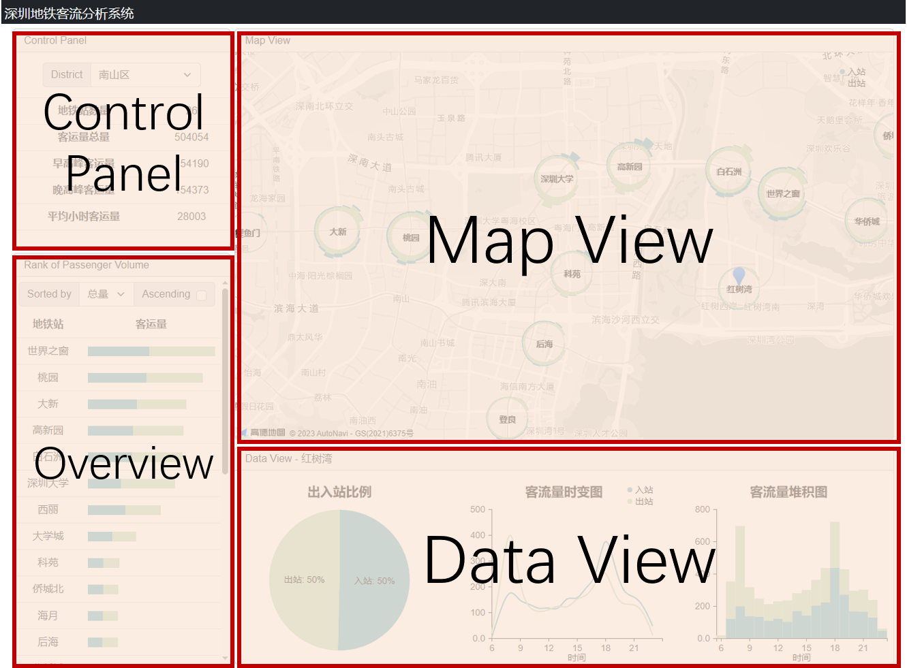
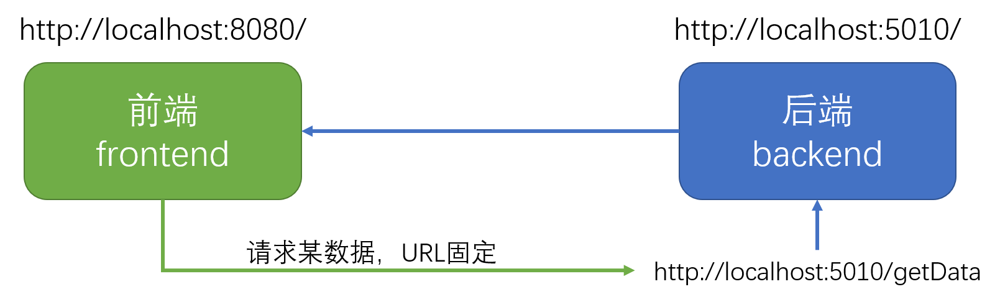

# newCodingTemplate
一个基于 Vue 3.0 + Flask的Web App模板  
***  

## 写在前面  
**如果想要较好的使用该框架，强烈建议提前学习以下内容:**   

**基本概念:**   
1. 前端和后端各自的职责, 为什么需要前后端分离? 
2. HTML、CSS和JavaScript的基本概念及相互关系
3. 前端发送的get和post请求有什么区别?

**前端:**  
1. HTML和CSS: 网页盒子模型(margin, padding, border, width, height之间的关系), 常用标签(h1-h6, p, div, input, button), 定位(display, float, position)
2. JavaScript基本语法 (变量, 常用数据类型, 循环, 判断, 函数, 其实感觉跟C语言很像)
3. D3.js: 简单画个柱状图、折线图、散点图, 体会到d3画图的特点即可(Data Driven Document, 将数据与图表元素绑定)    
4. Vue: 前端框架, 了解component的概念, 如何实现一个component, Vue如何进行数据双向绑定(v-model, v-bind, v-if, v-for), 了解component内部的this

**后端:**  
1. Python基本语法  
2. Flask(可选): 相对于Vue, Flask比较直接, 直接看框架也行  


***  
## 目录
- [newCodingTemplate](#newcodingtemplate)
  - [写在前面](#写在前面)
  - [目录](#目录)
  - [运行指南](#运行指南)
    - [环境配置](#环境配置)
      - [前端](#前端)
      - [后端](#后端)
    - [运行框架](#运行框架)
      - [运行前端](#运行前端)
      - [运行后端](#运行后端)
  - [Web框架总览](#web框架总览)
  - [目录结构](#目录结构)
    - [前端](#前端-1)
      - [1. frontend目录](#1-frontend目录)
      - [2. package.json](#2-packagejson)
      - [3. 前端代码目录 (./frontend/src)](#3-前端代码目录-frontendsrc)
    - [后端](#后端-1)
  - [可能遇到的问题](#可能遇到的问题)
***  

## 运行指南
### 环境配置
#### 前端  
使用Node.js作为JavaScript的运行环境, NPM为Node.js的包管理器  
推荐安装v16, 过高版本可能导致框架无法运行    
Node.js: https://nodejs.org/zh-cn/download/  

初始化：
以下操作在命令行中进行,只用执行一次:  
1. 进入目录 .../newCodingTemplate/frontend/
2. 输入 npm install .
3. npm自动下载所需的包

#### 后端  
使用Anaconda作为python的运行环境  
(安装过程中建议添加至系统环境变量)  
  
Anaconda：https://www.anaconda.com/products/distribution  
Anaconda默认的下载源在国外, 访问较慢,可以换成清华源：https://mirrors.tuna.tsinghua.edu.cn/help/anaconda/  
安装flask：在命令行中执行 conda install flask 或 pip install flask  
如果缺少其他库, 一并安装

### 运行框架  
准备两个命令行终端,一个前端,一个后端,不要关闭
#### 运行前端  
以下操作在命令行中进行:  
1. 进入目录 .../newCodingTemplate/frontend/
2. 输入 npm run serve
3. 运行成功结果  

 </img> 

#### 运行后端
以下操作在命令行中进行:  
1. 进入目录 .../newCodingTemplate/backend/
2. 输入 python run-data-backend.py
3. 运行成功结果  

 </img> 
  
前后端均运行成功后,用浏览器访问<a href="http://localhost:8080/">http://localhost:8080/</a>,能看到以下页面：  
 </img>   

## Web框架总览
该框架采用前后端分离的开发模式,前端框架采用Vue 3.0,语言是JavaScript,后端框架采用flask,语言是python。  
前端实现网页及交互,后端用于处理数据。  
当前端需要获取数据时,会向后端发送数据请求,后端会将处理好的数据反馈给前端。   
  
|  | 端口号 | URL |
| :----: | :----: | :----: |
| 前端 | 8080 | https://127.0.0.1:8080/ |
| 后端 | 5010 | https://127.0.0.1:5010/ |

(127.0.0.1相当于localhost, 指本地计算机)
  
 </img> 

## 目录结构
### 前端
#### 1. frontend目录  
.../newCodingTemplate/frontend/的文件夹内容如下： 

| 文件/文件夹名称 | 主要内容 |
| :----: | :----: |
| ./node_modules | npm下载的包 |
| ./src | 前端代码 |
| package.json | 包管理描述文件 |

#### 2. package.json  
package.json文件描述了npm的各项设置,主要是需要安装什么包,安装什么版本,以及报错规则,文件打开是一个字典  
"dependencies"指需要下载的包,需要注明包的名称以及版本要求,具体可参考:  

| 写法 | 含义 |
| :----: | :----: |
| "4.0.3" | 安装4.0.3版本 |
| "~4.1.3" | 安装4.1.x版本,不低于4.1.3 |
| "^4.2.3" | 安装4.x.x版本,不低于4.2.3 |
| "latest" | 安装最新版本 |  
  
"rules"指报错规则,这里的报错还包括代码书写规范,例如"禁止使用八进制数字"、"禁止使用++,--"等  
vue采用eslint规则,具体可参考: https://www.jianshu.com/p/efeeaacc6ef0  
  
不规范的写法会降低代码的可读性,有必要做出一定限制,但有些规则可以考虑关闭,例如"no-unused-vars"(变量声明后必须使用)：  
```javascript
    "rules": {
      "no-console": 0,
      "no-unused-vars": 0
    },  
```  
  
更新package.json后,需要重新npm install  

#### 3. 前端代码目录 (./frontend/src)
**强烈建议学习Vue之后阅读!**  
Vue 2.0教程: https://learning.dcloud.io/#/?vid=0  
Vue 3.0教程: https://www.vuemastery.com/courses/intro-to-vue-3/intro-to-vue3 (比较推荐,看前几个免费的就够了)  
Vue 3.0兼容Vue 2.0的写法, 学哪个无所谓。Vue的教程往往会讲很多内容, 不用都看, 了解component的概念, 如何写一个component, 如何进行双向绑定(v-model, v-for, v-bind, v-if，{{ }} ), 了解component内部的this
***

./src目录下有很多文件与文件夹,比较重要的如下表所示:  

| 文件/文件夹名称 | 主要内容 |
| :----: | :----: |
| ./components | vue组件 |
| ./service | 数据请求、组件信息传递的代码 |
| App.vue | 前端主组件 |
| main.js | 创建APP |

下面简要说明:  
**(1) 各个组件 (./components)**   
网站的各个View其实就是一个个component  
 </img>  

每个component都有一个独立的文件夹,HTML、CSS、JS代码都可以独立修改,最后在主组件组合即可。  
以DataView为例,在./components/DataView可以看到:     
  
| 文件名称 | 主要内容 |
| :----: | :----: |
| DataView.html | HTML模板 |
| DataView.js | component核心代码 |
| drawChart.js | 绘图函数 |
| DataView.vue | 组合HTML、CSS和JavaScript |   
    
    
1. component核心代码 (DataView.js)
  
首先发现这是一个字典:  
```javascript
//前面引入各种库
import DrawChart from './drawD3.js'
      
export default {  
    name: 'DataView',  
    components: {...},  
    props:{...},  
    data() {  
     return {...},  
    },  
    watch:{...},  
    mounted:{...},  
    methods:{...}  
}  
```
  
每个key都有对应的功能：  

| key | 含义 |
| :----: | :----: |
| name | 当前component名称 |
| components | 包含的components |
| props | 主组件传递的值 |
| data | 当前component内置的变量 |  
| watch | 监测某变量是否变化,变化后执行什么函数 | 
| mounted | 页面加载完成后执行的函数,可用于初始化 |   
| methods | 当前component内置的函数 |   
    
对于component而言,任何地方的`this`均指代当前component整体。可以使用`this.XXX`的形式调用/修改内置的变量或函数  


***  
2. 绘图函数 (drawChart.js) 
函数名称随意,我们当前component需要用到的绘图函数封装成一个对象：  
  
```javascript
//定义一个名叫DrawFunc的对象
var DrawChart = function () {	
    this.width = $('#pieChart').width();   //这里不是Vue的component, this指代DrawChart自身
    this.height = $('#pieChart').height();   //可以用this.xxx的写法添加属性/函数

    const margin = {top:60, bottom:40, left:50, right:10}
    this.margin = margin

    const idList = ['#pieChart','#lineChart','#stackBarChart']
    this.idList = idList
}
  
//向DrawFunc对象中添加drawPieChart函数
DrawFunc.prototype.drawPieChart = function (data) {  
    //绘图具体过程略
}

```  

3. DataView.vue和DataView.html  
DataView.html即为HTML文件, CSS样式可在DataView.vue中调整。此外, DataView.vue将HTML、CSS和JavaScript组合, 以下是DataView.vue的内容:   
```html
<template src='./DataView.html'></template>   引入HTML模板

<script src='./DataView.js'></script>   引入component

<style>
    各种CSS样式
</style>
```


**(2) 主组件 App.vue**  
主组件将各个component进行组合,文件像HTML和JavaScript的混合,可分为三部分: `<template>`、`<script>`和`<style>`   
（在VSCode中可安装插件Vue Language Feature辅助阅读）  
  
| 部分名称 | 主要内容 |
| :----: | :----: |
| `<template>` | HTML模板 |
| `<script>` | 主组件核心代码 |
| `<style>` | CSS样式 | 
  
    
1. 主组件核心代码 `<script>`  
这部分写法跟component差不多,区别在于要引用需要的component:  

```javascript  
import ControlPanel from './components/ControlPanel/ControlPanel.vue'   //引入各个component
import DataView from './components/DataView/DataView.vue'    
...
    
export default {
      name: 'app',  
      components: {  
        ControlPanel,  //注明使用的component  
        DataView,
        ...  
      },  
      // 其余部分略   
    }  
```  
      
2. HTML模板 `<template>`  
在此处写网页的HTML, 利用vue可以方便地快速组合各个component, 每个component可用特殊标签代替,例如`<ControlPanel></ControlPanel>`,`<DataView></DataView>`
  

**(3) 数据请求与信息传递 (./service)**  
1. 数据请求 (dataService.js)  
  
dataService较为简单,即向python后端发送请求,获得后端发送回来的数据。  
dataService.js前面不用动,只需在后面补充函数即可,有三种情况：  
        
| 请求情况 | 描述 |
| :----: | :----: |
| URL固定 | 向一个固定URL请求数据 |
| Get请求 | URL与某些变量有关,会变化,直接把变量注明在URL中 |
| Post请求 | URL与某些变量有关,但变量很复杂,没法直接注明在URL中 | 
  
（简要说明get和post的差别：get比较简单,因为变量直接写在URL中。但URL长度有限制（最多256个字符）,字典、列表也放不进去,把重要信息直接写在URL中也有风险。相比而言,post将信息打包,在URL中不可见,更安全,能携带的信息也更丰富）  

**三种情况示意图**  
  
 </img>   
 </img>   
 </img>   

***    

```javascript  
//请求数据的URL固定  
function getTest(callback) {
    const url = `${dataServerUrl}/test`
    const params = {}
    request(url, params, GET_REQUEST, callback)   
}

//Get请求：请求数据的URL中含有简单变量,直接写在URL中,例如:
//请求南山区的数据 - http://127.0.0.1:5010/district-info/南山区
function getDistrictInfo(district, callback) {   //接收一个参数district
    const url = `${dataServerUrl}/district-info/${district}`
    const params = {}
    request(url, params, GET_REQUEST, callback)   //注意是GET_REQUEST
}

//Post请求：请求数据时,需要提交更为复杂的信息
//例如我想传递一个列表,传递一个字典,没法直接写在URL中
function postTest(msg, callback) {
    const url = `${dataServerUrl}/postTest`
    const params = {
        "number": 123,
        "name": "POST",
        "msg": msg
    }

    request(url, params, POST_REQUEST, callback) 
}

//将函数打包进dataService
export default {
    ...,
    getTest,   //注意在文件末尾export default处添加你写的函数
    getDistrictInfo,
    postTest,
    ...,
}  
    
``` 

***
以下演示如何使用dataService, 我们需要根据需求, 补充callback回调函数, 接收到后端返回来的数据后, callback函数开始执行:     
```javascript  
import dataService from '../../service/dataService.js'  //注意import

//请求数据的URL固定
dataService.getTest((callback) => {
    const data = callback.data;   //回调函数的输入callback是后端返回的所有内容,但只有data属性是我们需要的数据
    
    //补充其他想要执行的代码,获得数据后开始执行
    
});

//Get请求：请求数据的URL中含有简单变量,直接写在URL中
const district = "南山区";

dataService.getDistrictInfo(district, (callback) => {  //除callback外,添加相关变量
    const data = callback.data;   //回调函数的输入callback是后端返回的所有内容,但只有data属性是我们需要的数据
    
    //补充其他想要执行的代码,获得数据后开始执行
    
});

//Post请求：请求数据时,需要提交更为复杂的信息
const msg = {
    school: "SYSU",
    academy: "ISE",
    hobbies: ["football","basketball"],
};

dataService.getDataPost(msg, (callback) => {  //除callback外,添加相关变量
    const data = callback.data;   //回调函数的输入callback是后端返回的所有内容,但只有data属性是我们需要的数据
    
    //补充其他想要执行的代码,获得数据后开始执行
    
});
```

***  

2. 信号传递 (pipeService.js)  
  
我们引入pipeService.js实现component之间的信息传递(例如在MapView中选择某个地铁站，DataView绘制该地铁站的统计图表)。pipeService.js的代码结构如下:  
  
```javascript
import mitt from 'mitt'   //需要使用mitt库
  
const bus = mitt()

var pipeService = {
    
    SELECT_DISTRICT: 'select_district',   //信号名称
    SELECT_STATION: 'select_station',
    
    emitSelectDistrict: function (msg) {   //发送select_district信号
        bus.emit(this.SELECT_DISTRICT, msg)
    },
    onSelectDistrict: function (callback) {   //接收select_district信号
        bus.on(this.SELECT_DISTRICT, function (msg) {
            callback(msg)
        })
    },

    ...
        
}
  
```  
同样, pipeService.js里面的函数是**一个通用的框架**,每个函数不需要改很多,只需要修改`bus.emit()`和`bus.on()`里面的信号名称即可。  
  
在调用pipeService时,则需要补充一些代码,下面举一个例子：  
  
发送select_district信号时,调用`pipeService.emitSelectDistrict`
```javascript
import pipeService from '../../service/pipeService.js'  //记得import pipeService

msg = {...}   //想要发送的信息
pipeService.emitSelectDistrict(msg);   //发送selected_district信号

```
  
其他component接收select_district信号时,**在component的mounted处**添加如下代码:  
```javascript  
import pipeService from '../../service/pipeService.js'  //注意import

组件其他部分略...
mounted:{
    pipeService.onAddCircle((msg) => {
    //msg为pipeService.emitAddCircle传递的变量
    
    //补充其他想要执行的代码,收到信号后开始执行
    console.log(msg);
    my_function(msg);
    ...
    
    });
},

```  


### 后端  
后端较为简单,在./backend/app/文件夹内可以看到三个文件夹:  
  
| 文件夹 | 含义 |
| :----: | :----: |
| ./data | 数据文件放在这 |
| ./dataService | 读取、处理数据的函数 |
| ./routes | 设置请求数据URL |
  
**(1) 设置请求数据URL (./routes/index.js)**   
进入./routes文件夹,打开index.py  
index.py记录了所有请求数据的URL,只需要在后面添加相应的函数即可,也是分三种情况:  

| 请求情况 | 描述 |
| :----: | :----: |
| URL固定 | 向一个固定URL请求数据 |
| Get请求 | URL与某些变量有关,会变化,直接把变量注明在URL中 |
| Post请求 | URL与某些变量有关,但变量很复杂,没法直接注明在URL中 | 
   
```python
# 请求数据的URL固定
@app.route('/test')   # 请求该数据的URL
def test():
    result = {"test":123}
    return json.dumps(result)  # 返回json格式的数据给前端
    
# Get请求：请求数据的URL和某些变量有关,变量直接写在URL中
@app.route('/district-info/<district>')   #<district>指将URL的这一部分赋值给district变量
# 例如：前端向http://localhost:5010/district-info/南山区 发送请求,那么district="南山区"
def _get_district_info(district):
    result = dataService.get_district_info(district)  # 读取、处理数据的函数
    return json.dumps(result)  # 返回json格式的数据给前端

# Post请求：提交给后端的数据更为复杂
@app.route('/postTest',methods=['POST'])   #注明接收post请求
def _get_post_data():
    post_request = request.json   #post请求的原始数据比较复杂,用.json方式直接获得我们需要的内容
    result = dataService.get_post_data(post_request)  # 读取、处理数据的函数
    return json.dumps(result)  # 返回json格式的数据给前端
```  

**(2) 读取、处理数据 (./dataService/dataService.py)**   
进入./dataService文件夹,打开dataService.py  
dataService.py记录了所有读取、处理数据的函数,封装在DataService类中,可直接在后面添加新的函数:  

```python
import GlobalVariable as GV  #模板中将数据文件地址保存在GlobalVariable.py中,为了方便不做这一步也行

class DataService(object):   #定义DataService类
    def __init__(self):   #初始化
        self.GV = GV
        print('=================================================')
        return

    #其余函数略

    # 数据的位置和某些变量有关
    def get_district_info(self, district):
        data = pd.read_csv("{}/district_info.csv".format(GV.DATA_FOLDER))
        data = data[data["district"]==district]
        
        """
        读取数据后的处理过程略
        
        """
        
        return result  # 返回处理好的数据, 需要保证传回json格式的数据

```  
      
**(3) 判断是否能获取数据**    

后端只要接收到数据请求就会返回数据, 可以直接用浏览器访问数据请求地址,例如: http://127.0.0.1:5010/test
如果成功,将会看到一个数据页面,运行后端的命令行也会有提示:  
  
 </img>   
   
 </img>   
  
如果失败,网页无法打开,命令行也会报错  

## 可能遇到的问题
1. 前端报错

2. 修改了后端代码,没有效果  
关闭后端(ctrl+c),重新启动后端   
